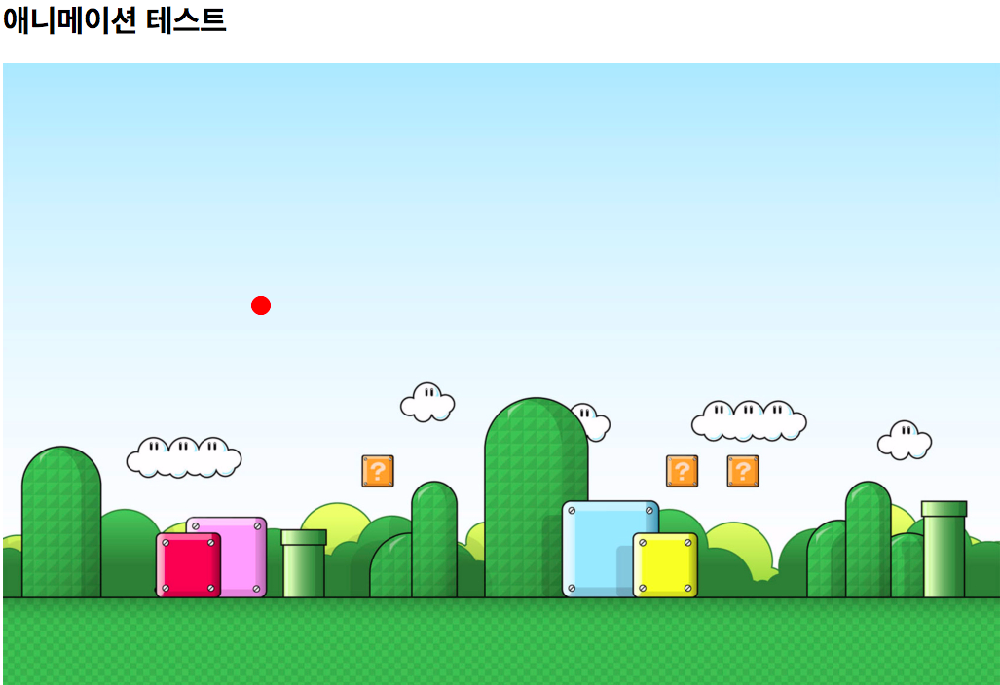

## Animation 만들기
---
### output

### description

배경 이미지 위에 공을 만들고, setInterval()함수를 활용하여 이동하게 한다

공은 벽면에 부딪힐 때마다 기존 속도의 -1.1배가 된다

### analysis

1.

처음 배경 이미지와 공을 그렸을 때, 공이 배경 이미지 뒤에 그려져 화면에 보이지 않았다

이유는 onload 함수가 drawImage 함수를 callback하여 매개변수로 사용하고 있기 때문에 비동기 방식으로 처리 되었기 때문이다

그렇기 때문에 이후의 작업인 공을 먼저 그리고 배경 이미지를 불러오게 되어 공은 배경 이미지 뒤에 숨어있게 된 것

여기서 callback함수는 아무도 호출하지 않지만 실행된다. 언제 호출할지를 결정하는 것은 브라우저다

이를 해결하기 위해서 공을 그리는 작업도 callback되게 하여(setInterval(drawAll, 300)) 지연시킨다

배경이미지를 내려 받는 것과 공을 그리는 작업 둘 다 callback되기 때문에 setInterval보다 더 우선순위인 onload 함수가 실행되어

배경이미지를 먼저 내려 받고 공을 그릴 수 있게 된 것이다

2.

공이 벽면에 부딪히고 반대로 튕겨나오면서 가속이 될 때, 사라지는 경우가 생겼다

이유는 check 함수에서 공의 방향이 바뀌는 조건을 공의 위치가 배경 이미지의 끝 부분에 도착할 때라고 판단했지만 그 위치가 범위를 바로 넘어서는 경우가 발생했다

이를 해결하기 위해서 조건을 x, y 각 끝 위치에 도달(===)했을 때가 아닌, 넘어설때(<, >)로 변경하였다
