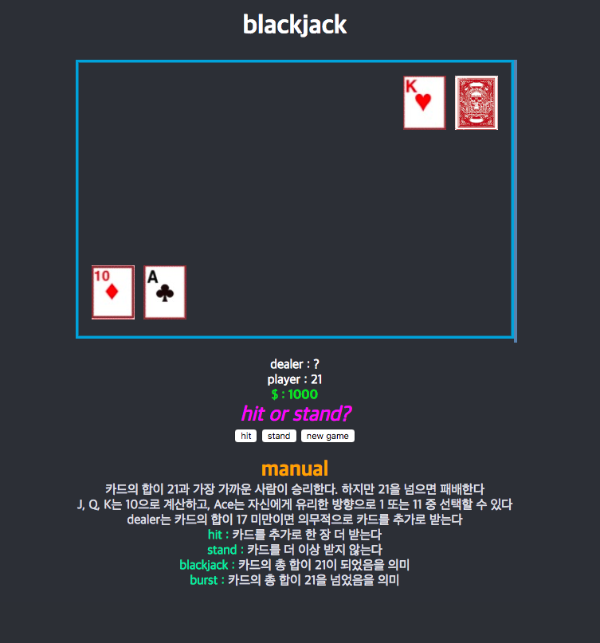

## 블랙잭
---
### output



### analysis

혼자서 객체를 처음으로 사용해 보았다

Ace를 상황에 따라 1과 11로 나누어 계산하는 것에 어려움이 있었지만 default 값을 11로 하고 case를 잘 나누어 문제를 해결하였다

카드가 분출 될 때마다, 카드 배열의 마지막 원소를 이용해 이미지를 생성하는 것에 어려움이 있었다

왜냐하면, javascript가 비동기로 동작 되어 카드가 전부 분출 된 이후에 마지막 원소만 이미지로 분출했기 때문

인터넷을 참조하여 아래와 같은 방식으로 해결했으나, 아직까지 잘 이해가 가지 않는다

이후에 좀 더 공부해 볼 필요가 있다

```javascript
function renderCard(target, i) {
  if (target === player) {
    var cardImage = new Image();
    cardImage.onload = (function(value){
        return function(){
            ctx.drawImage(this, 20 + (i * 65), 258, 54, 68);
        }
    })(i);
    cardImage.src = "./images/" + target.cards[i] + ".png"
  } else if(target === dealer){
    var cardImage = new Image();
    cardImage.onload = (function(value){
        return function(){
            ctx.drawImage(this, 476 - (i * 65), 20, 54, 68);
        }
    })(i);
    cardImage.src = "./images/" + target.cards[i] + ".png"
  }
}
```
